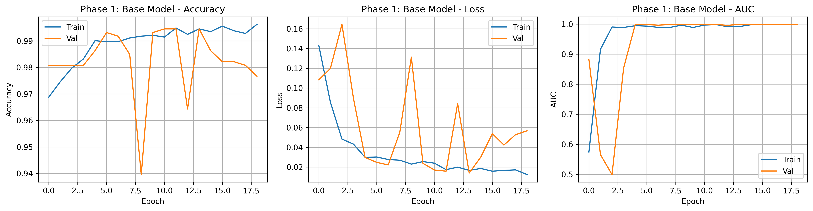
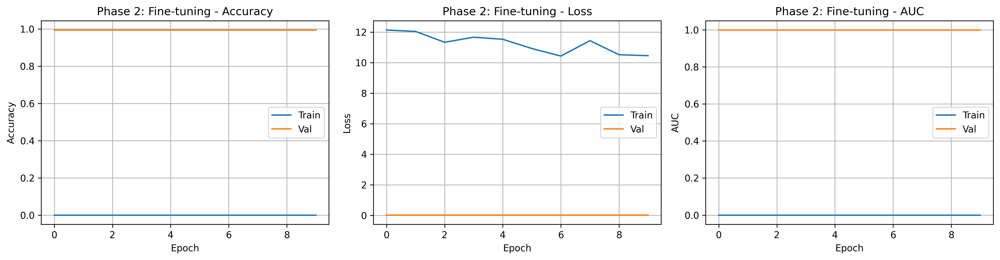

# IoMT Edge Patient Monitor

**An autonomous, multimodal edge-AI system for continuous patient monitoring and triage.**

Hospital staff cannot watch every patient 24×7, and the automated systems that exist (bed alarms, fall detectors) generate so many false positives that nurses learn to ignore them. This project is an Internet of Medical Things (IoMT) prototype that tackles both problems: a wearable ESP32 edge node streams ECG and motion data over MQTT into a time-series pipeline, and three AI modalities — **ECG arrhythmia detection**, **EHR-based clinical risk prediction**, and **motion/vision-based event recognition** — are fused so that staff are alerted only when an anomaly is corroborated by more than one signal.

> Built by Team AJAS — Aakarsh Mishra, Joshua Koilpillai, Aayush Khatanhar, Saharsh Kallu (with data-collection help from Ronith and Lohith). Full write-up in [`docs/IoMT_Project_Report.pdf`](docs/IoMT_Project_Report.pdf); slides in [`docs/IoMT_Presentation.pptx`](docs/IoMT_Presentation.pptx).

---

## System architecture

```
 ┌──────────────── Edge node (ESP32) ────────────────┐
 │  AD8232 ECG ──┐                                   │
 │               ├─ 360 Hz sampling, DC-offset        │      MQTT (JSON / line protocol)
 │  MPU6050 IMU ─┘  removal, moving-avg filter,      │ ─────────────────────────────────▶  Mosquitto broker
 │                  on-device fall heuristics         │        test/ecg_raw  (360 samples/s)
 └───────────────────────────────────────────────────┘        test/sensors  (1 Hz dashboard)
                                                                          │
 ┌──────────── ESP32-CAM ────────────┐                                    ▼
 │  MJPEG stream over HTTP           │ ──▶ vision model            Telegraf ──▶ InfluxDB ──▶ Grafana dashboard
 └───────────────────────────────────┘                                    │
                                                                          ▼
                     ┌────────────────────────────────────────────────────────────────────┐
                     │  AI layer                                                          │
                     │   • Arrhythmia CNN   (ECG windows)         → medical risk          │
                     │   • EHR multi-task NN (patient history)    → clinical risk         │
                     │   • Motion CNN + Vision CNN (IMU, camera)  → physical event +      │
                     │                                              visual confirmation   │
                     │                                                                    │
                     │   Alert  ⇐  medical risk + physical event + visual confirmation    │
                     │             exceeds threshold                                      │
                     └────────────────────────────────────────────────────────────────────┘
```

**Hardware:** ESP32 dev board, AD8232 single-lead ECG front-end, MPU6050 6-axis IMU, ESP32-CAM (OV2640).
**Transport & storage:** MQTT (PubSubClient) → Telegraf → InfluxDB, visualised in Grafana.

---

## Repository layout

| Path | What it is |
|---|---|
| [`firmware/ecg_imu_node/`](firmware/ecg_imu_node/) | ESP32 sketch: samples the AD8232 at 360 Hz, filters it, batches 1-second windows to `test/ecg_raw`; reads the MPU6050 and publishes a 1 Hz dashboard line to `test/sensors`; contains impact + stillness fall-detection heuristics. |
| [`firmware/camera_webserver/`](firmware/camera_webserver/) | ESP32-CAM MJPEG streaming server (based on the Espressif example) used as the visual input for the vision model. |
| [`arrhythmia/`](arrhythmia/) | ECG arrhythmia classifier — Colab notebook, trained base model weights, MIT-BIH + self-collected datasets, training/validation plots. |
| [`ehr_risk/`](ehr_risk/) | EHR clinical-risk engine — FHIR preprocessing, multi-task Keras model, TFLite export, standalone demo. |
| [`gesture_recognition/`](gesture_recognition/) | IMU motion classifier (1-D CNN in PyTorch) for falls, seizures, agitation, etc. |
| [`vision/`](vision/) | MobileNetV3-Small fine-tuned to classify camera frames as *Normal / Distress / Danger*; live webcam runner. |
| [`docs/`](docs/) | Project report and presentation. |

---

## The three AI modalities

### 1. Arrhythmia detection (`arrhythmia/`)

A 1-D CNN (Conv 32 → 64 → 128 with BatchNorm, MaxPool and Dropout, then global-average-pooling and a sigmoid head) classifies 1-second (360-sample) ECG windows as normal vs. arrhythmic.

- **Data.** 48 records from the [MIT-BIH Arrhythmia Database](https://physionet.org/content/mitdb/) (exported to CSV with beat annotations in `raw_data/mitbih/`), plus 120 ten-second recordings collected from team members with our own AD8232 node (`raw_data/collected/normal/`). To obtain "abnormal" rhythms safely, team members recorded after bursts of strenuous exercise (`raw_data/collected/arrhythmia/`).
- **Training.** Two-stage *domain adaptation*: a base model is trained on MIT-BIH, then fine-tuned on the low-cost-sensor data so it generalises to our hardware. Class-weighted loss handles the heavy normal/arrhythmia imbalance; early stopping monitors validation AUC.
- **Results.** Base model on MIT-BIH held-out test: **AUC 0.93**. After fine-tuning on sensor data: **accuracy 99.6 %, AUC 0.999** on the sensor test split (see `training_results/training_summary.json`).

| Training curves (base) | Fine-tuning curves |
|---|---|
|  |  |

### 2. EHR risk prediction (`ehr_risk/`)

A multi-task neural network that reads a patient's recent history and outputs a probability for each of a set of clinical risks (`risk_sepsis_24h`, `risk_mi_24h`, `risk_stroke_24h`, `risk_heart_failure_24h`, …). The full experiment covered 130+ features and 51 conditions × 3 horizons (6 h / 24 h / 48 h) = 153 heads over 10 M+ records; the checkpoint bundled here is the 24 h variant (61 features → 51 heads).

- **Data pipeline (`ehr_preprocess.py`).** Parses FHIR JSON patient bundles (demographics, conditions, observations), builds per-patient time-series of vitals/labs with 3-hour rolling averages and delta features, and streams everything to chunked Parquet so datasets far larger than RAM can be processed.
- **Model (`ehr_model.py`).** Shared body (BatchNorm → Dense 128 → Dense 64) feeding one small sigmoid head per risk, trained jointly with binary cross-entropy and per-head AUC. Training (`ehr_train.py`) uses an out-of-core `tf.data`-style generator over the Parquet chunks.
- **Deployment.** The trained model is exported both as `ehr_model.keras` and as `ehr_model.tflite` for edge inference; `test_ehr_performance.py` benchmarks TFLite latency and `ehr_only_demo.py` scores the sample patients in `EHR_patient_records.json`.

### 3. Physical event recognition — IMU + vision (`gesture_recognition/`, `vision/`)

This modality exists to kill false alarms. A motion event flagged by the IMU is only escalated if the camera agrees.

- **IMU classifier.** A compact 1-D CNN (`WardGuardianCNN`) over 1.5 s windows (75 samples @ 50 Hz, 3-axis accelerometer) predicting 12 states: lying, sitting, walking, **fall**, **seizure**, slump, agitation, choking, vomiting, CPR-in-progress, respiratory distress, transport. Walking and fall windows come from the [SisFall](https://www.mdpi.com/1424-8220/17/1/198) dataset with a *subject-aware* split (test subjects never seen in training); the remaining classes are generated from physics-inspired synthetic signals. `sanity_check.py` probes the model with hand-crafted signals; `evaluate_model.py` produces the confusion matrix.
- **Vision classifier.** MobileNetV3-Small (ImageNet-pretrained; last three feature blocks + head fine-tuned) with heavy augmentation to cope with odd CCTV-like angles. Classifies frames into *Normal / Distress / Danger*. `run_webcam.py` runs it live on a webcam or the ESP32-CAM stream.

| IMU model — confusion matrix | Vision model — training metrics |
|---|---|
|  |  |

**Fusion.** The final alert score is `medical_risk + physical_event + visual_confirmation`; the nurse is paged only when this weighted sum crosses a threshold, so a patient merely shifting in bed does not trigger an alarm.

---

## Getting started

### Python environment

```bash
python -m venv .venv && source .venv/bin/activate
pip install -r requirements.txt
```

### Arrhythmia model

`arrhythmia/ecg.ipynb` is a Colab notebook: it downloads MIT-BIH via `wfdb`, trains the base model, and renders an interactive Plotly evaluation dashboard. The trained base weights are in `arrhythmia/base_model/` (Keras 3 format — load with `keras.models.model_from_json` on `config.json` and `load_weights` on `model.weights.h5`).

### EHR risk engine

```bash
cd ehr_risk
python ehr_only_demo.py            # score the bundled sample patients with the trained model
python test_ehr_performance.py     # TFLite latency benchmark

# To retrain from scratch, place a zip of FHIR JSON bundles at ehr_risk/fhir.zip, then:
python ehr_preprocess.py           # → final_parquet_chunks/
python ehr_train.py                # → ehr_model.keras, ehr_scaler.joblib, feature/target lists
```

### Gesture (IMU) model

```bash
cd gesture_recognition
python sanity_check.py             # quick physics-based probe of ward_model.pth
# To retrain: download SisFall into gesture_recognition/SisFall_dataset/, then
python process_ward_data.py && python train_ward_model.py
```

### Vision model

```bash
cd vision
python run_webcam.py               # live inference on webcam 0 using vision_model.pth
# To retrain: put images in Ward_Vision_Data/{train,val}/{Normal,Distress,Danger}/ and run train_vision.py
```

### Firmware

Open either sketch folder in the Arduino IDE with the ESP32 board package installed.

- `firmware/ecg_imu_node/` needs the `PubSubClient` and `ArduinoJson` libraries. Set `ssid`, `password` and `mqtt_server` at the top of the sketch. Wiring: AD8232 `OUTPUT`→GPIO34, `LO+`→GPIO32, `LO-`→GPIO33; MPU6050 over I²C at `0x68`.
- `firmware/camera_webserver/` targets the AI-Thinker ESP32-CAM (select the board model in the sketch). Set the Wi-Fi credentials, flash, and open the printed IP in a browser for the MJPEG stream.

### Backend

Any MQTT broker works (we used Mosquitto). A Telegraf `[[inputs.mqtt_consumer]]` subscribed to `test/sensors` (InfluxDB line protocol) and `test/ecg_raw` (CSV of 360 ints) feeds InfluxDB; Grafana reads from there.

---

## Engineering notes

- **Sensor noise vs. medical-grade data.** The AD8232 on a 12-bit ADC is far noisier than the MIT-BIH recordings. The firmware does slow adaptive baseline tracking for DC-offset removal and a 7-tap moving-average filter before publishing; the model side compensates with the fine-tuning stage on real sensor data.
- **Class imbalance.** Normal beats vastly outnumber arrhythmic ones; class-weighted loss and AUC-based early stopping replaced accuracy as the optimisation target after early models collapsed to the majority class.
- **Out-of-core EHR training.** The FHIR corpus exceeded available RAM, so preprocessing writes chunked Parquet and training streams mini-batches from disk with aggressive dtype down-casting.
- **Honest evaluation for motion data.** SisFall windows are split by *subject*, not randomly, so reported accuracy reflects unseen patients rather than memorised gait signatures.

## Future work

Integration with hospital information systems via HL7/FHIR connectors, federated learning across edge nodes for privacy, a low-power mesh (Zigbee/LoRaWAN) for hospital-scale deployment, sensor self-diagnostics, and a hospital-at-home mode for post-discharge monitoring. See §6 of the report.

## Acknowledgements

MIT-BIH Arrhythmia Database (PhysioNet), SisFall dataset (Universidad de Antioquia), and the Espressif `CameraWebServer` example on which the camera firmware is based.
