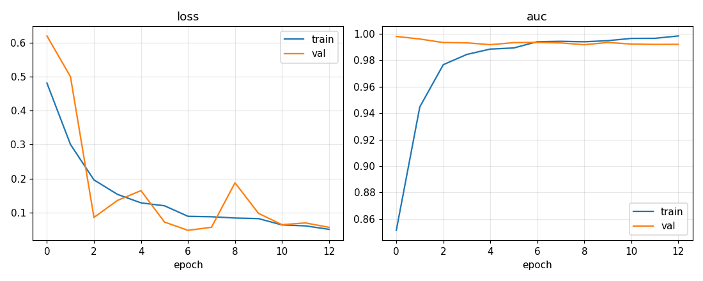
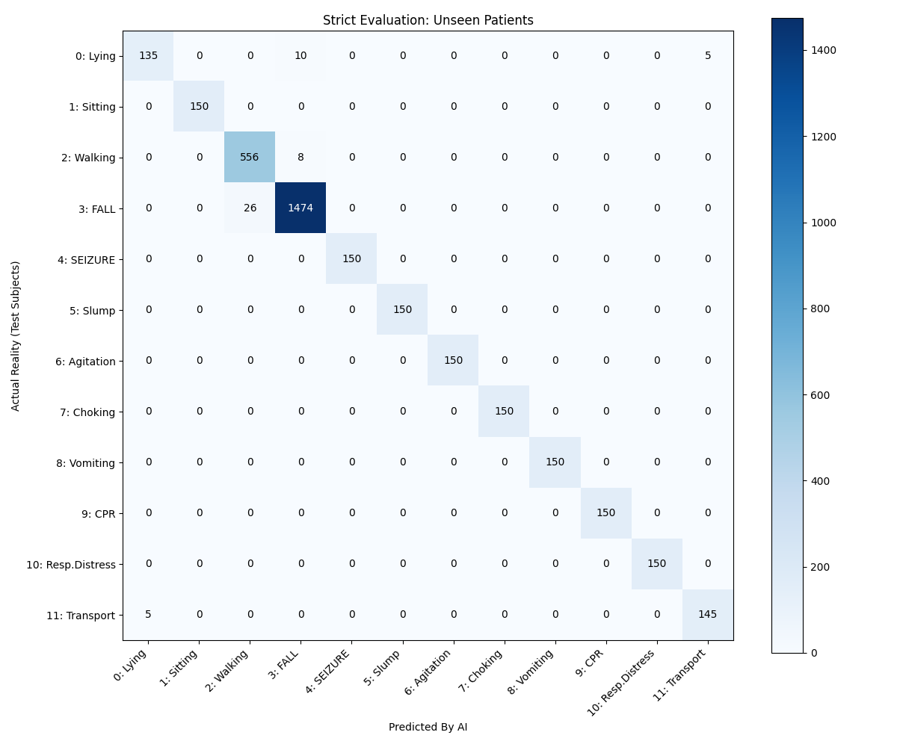
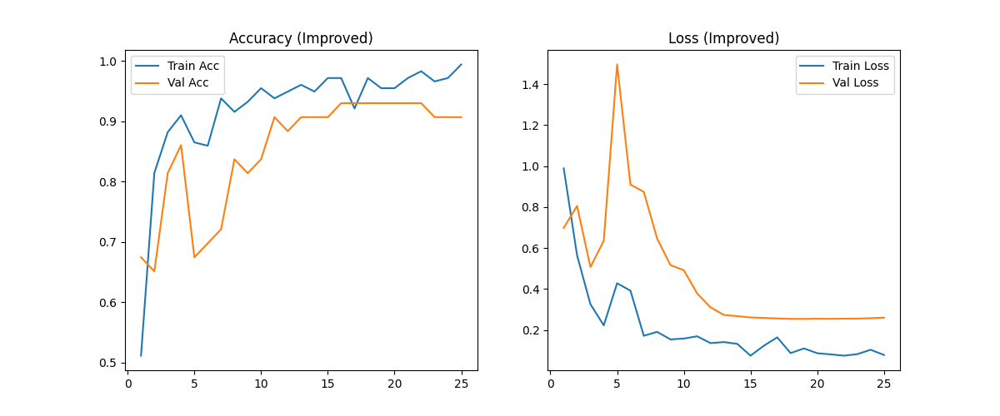

# IoMT Edge Patient Monitor

[](https://github.com/Aakarsh1402/iomt-edge-patient-monitor/actions/workflows/checks.yml)

**An autonomous, multimodal edge-AI system for continuous patient monitoring and triage.**

Hospital staff cannot watch every patient 24×7, and the automated systems that exist (bed alarms, fall detectors) generate so many false positives that nurses learn to ignore them. This project is an Internet of Medical Things (IoMT) prototype that tackles both problems: a wearable ESP32 edge node streams ECG and motion data over MQTT into a time-series pipeline, and three AI modalities — **ECG arrhythmia detection**, **EHR-based clinical risk prediction**, and **motion/vision-based event recognition** — are fused so that staff are alerted only when an anomaly is corroborated by more than one signal.

**Runs on a laptop.** Every model, the MQTT pipeline and the alert fusion run on a CPU with no hardware, broker or GPU — `python run_checks.py` exercises all of it in about a minute.

> Built by Team AJAS — Aakarsh Mishra, Joshua Koilpillai, Aayush Khatanhar, Saharsh Kallu (with data-collection help from Ronith and Lohith). Full write-up in [`docs/IoMT_Project_Report.pdf`](docs/IoMT_Project_Report.pdf); slides in [`docs/IoMT_Presentation.pptx`](docs/IoMT_Presentation.pptx).

---

## System architecture

```
 ┌──────────────── Edge node (ESP32) ────────────────┐
 │  AD8232 ECG ──┐                                   │
 │               ├─ 360 Hz sampling, DC-offset        │      MQTT (JSON / line protocol)
 │  MPU6050 IMU ─┘  removal, moving-avg filter,      │ ─────────────────────────────────▶  Mosquitto broker
 │                  on-device fall heuristics         │        test/ecg_raw  (360 samples/s)
 └───────────────────────────────────────────────────┘        test/sensors  (1 Hz dashboard)
                                                                          │
 ┌──────────── ESP32-CAM ────────────┐                                    ▼
 │  MJPEG stream over HTTP           │ ──▶ vision model            Telegraf ──▶ InfluxDB ──▶ Grafana dashboard
 └───────────────────────────────────┘                                    │
                                                                          ▼
                     ┌────────────────────────────────────────────────────────────────────┐
                     │  AI layer                                                          │
                     │   • Arrhythmia CNN   (ECG windows)         → medical risk          │
                     │   • EHR multi-task NN (patient history)    → clinical risk         │
                     │   • Motion CNN + Vision CNN (IMU, camera)  → physical event +      │
                     │                                              visual confirmation   │
                     │                                                                    │
                     │   Alert  ⇐  medical risk + physical event + visual confirmation    │
                     │             exceeds threshold                                      │
                     └────────────────────────────────────────────────────────────────────┘
```

**Hardware:** ESP32 dev board, AD8232 single-lead ECG front-end, MPU6050 6-axis IMU, ESP32-CAM (OV2640).
**Transport & storage:** MQTT (PubSubClient) → Telegraf → InfluxDB, visualised in Grafana.

---

## Repository layout

| Path | What it is |
|---|---|
| [`firmware/ecg_imu_node/`](firmware/ecg_imu_node/) | ESP32 sketch: samples the AD8232 at 360 Hz, filters it, batches 1-second windows to `test/ecg_raw`; reads the MPU6050 and publishes a 1 Hz dashboard line to `test/sensors`; contains impact + stillness fall-detection heuristics. |
| [`firmware/camera_webserver/`](firmware/camera_webserver/) | ESP32-CAM MJPEG streaming server (based on the Espressif example) used as the visual input for the vision model. |
| [`arrhythmia/`](arrhythmia/) | ECG arrhythmia classifier — local training (`ecg_train.py`), inter-patient evaluation, CLI scoring, the trained `ecg_model.keras`, MIT-BIH (signals + beat annotations) and self-collected AD8232 recordings. |
| [`ehr_risk/`](ehr_risk/) | EHR clinical-risk engine — FHIR preprocessing, multi-task Keras model, TFLite export, standalone demo. |
| [`gesture_recognition/`](gesture_recognition/) | IMU motion classifier (1-D CNN in PyTorch) for falls, seizures, agitation, etc. |
| [`vision/`](vision/) | MobileNetV3-Small fine-tuned to classify camera frames as *Normal / Distress / Danger*; runner for webcam, video, images or the ESP32-CAM stream. |
| [`fusion/`](fusion/) | The alert-fusion engine (corroboration rules, alert levels), `run_monitor.py` (scripted or live over MQTT), a simulated ESP32 node, a pure-Python MQTT broker and `live_demo.py` which wires them together. |
| [`tests/`](tests/) | `pytest` suite: fusion rules, MQTT broker, MIT-BIH parsing, EHR encoding + engine, and every model checkpoint. |
| [`run_checks.py`](run_checks.py) | Runs the tests plus each module's evaluation and both demos, with a pass/fail scoreboard. |
| [`docs/`](docs/) | Project report and presentation. |

---

## The three AI modalities

### 1. Arrhythmia detection (`arrhythmia/`)

A 1-D CNN over 10-second (3600-sample, 360 Hz) ECG windows outputs P(arrhythmia). Four conv blocks with early pooling and a dilated last block give a ~2.5 s receptive field, so the network sees rhythm as well as beat shape; 209 k parameters, trains in ~2 min on a laptop CPU.

- **Data.** 48 records of the [MIT-BIH Arrhythmia Database](https://physionet.org/content/mitdb/) (signals as CSV, original `.atr` beat annotations parsed by `mitbih.py`), plus 120 ten-second recordings from four team members on our own AD8232 node (`raw_data/collected/normal/`). A window is *arrhythmic* if it lies in an abnormal rhythm (AFIB, flutter, VT, bigeminy, …) or holds ≥ 2 ectopic beats; windows with a single ectopic beat are dropped as ambiguous.
- **Protocol (`ecg_train.py`).** Inter-patient split of de Chazal et al.: DS1 records train (4 held out for early stopping), DS2 records test, so no patient appears on both sides. Sensor recordings are split by *volunteer* (two train, two test). Every window is baseline-corrected and scaled to unit variance before the network (`preprocess_windows`), which makes ADC counts from the sensor and millivolts from MIT-BIH interchangeable. Augmentation: random polarity flip and white noise up to the sensor's level.
- **Results (`ecg_evaluate.py`, `training_results/ecg_training.json`).** On the 22 unseen DS2 patients: **AUC 0.92, sensitivity 0.90, specificity 0.77** at threshold 0.5. On the 44 normal recordings from the two held-out volunteers: **0 false positives**. The main failure mode is morphology, not rhythm: two normal DS2 records with unusual T waves (113, 117) are flagged throughout. The three post-exercise recordings (~140 bpm) score 0.96–0.99; they were never labelled by a clinician, so that is reported but not claimed.
- **What is checked in.** `ecg_model.keras` (2.6 MB) and the exact protocol that produced it. The older notebook model (`base_model/`, `ecg.ipynb`) is kept for reference: it fed raw millivolts through a scaler it never saved and split overlapping windows at random, so its 0.93 AUC did not survive contact with unseen patients or the sensor.

| Training curves | Held-out sensor recordings are scored, not just MIT-BIH |
|---|---|
|  | `python arrhythmia/ecg_infer.py arrhythmia/raw_data/collected` → normal 0/120 flagged |

### 2. EHR risk prediction (`ehr_risk/`)

A multi-task neural network that reads a patient's recent history and outputs a probability for each of a set of clinical risks (`risk_sepsis_24h`, `risk_mi_24h`, `risk_stroke_24h`, `risk_heart_failure_24h`, …). The full experiment covered 130+ features and 51 conditions × 3 horizons (6 h / 24 h / 48 h) = 153 heads over 10 M+ records; the checkpoint bundled here is the 24 h variant (61 features → 51 heads).

- **Data pipeline (`ehr_preprocess.py`).** Parses FHIR JSON patient bundles (demographics, conditions, observations), builds per-patient time-series of vitals/labs with 3-hour rolling averages and delta features, and streams everything to chunked Parquet so datasets far larger than RAM can be processed.
- **Model (`ehr_model.py`).** Shared body (BatchNorm → Dense 128 → Dense 64) feeding one small sigmoid head per risk, trained jointly with binary cross-entropy and per-head AUC. Training (`ehr_train.py`) uses an out-of-core `tf.data`-style generator over the Parquet chunks.
- **Deployment.** The trained model is exported both as `ehr_model.keras` and as `ehr_model.tflite` for edge inference; `test_ehr_performance.py` benchmarks TFLite latency and `ehr_only_demo.py` scores the sample patients in `EHR_patient_records.json`.
- **Scoring records correctly (`ehr_engine.py`).** Training rows hold *one* observation each (demographics + history + the single vital/lab recorded at that moment), so a patient is scored as one row per observation with the per-risk maximum taken across rows — feeding a full vitals panel at once lands 10–2000 SD out of distribution and every head reads 0 %. Features that never varied in training are pinned (a non-zero value there is amplified ~30× by the first BatchNorm), and inputs in the wrong units (e.g. d-dimer in ng/mL) are flagged.
- **Known limits of the bundled checkpoint.** 31 of the 51 heads never fired during training (their label rules depend on features such as troponin that the 61-input model does not have) and always output 0 — the demo labels those explicitly. TFLite does not preserve head order; `ehr_tflite_map.py` recovers it into `ehr_tflite_outputs.json`.

### 3. Physical event recognition — IMU + vision (`gesture_recognition/`, `vision/`)

This modality exists to kill false alarms. A motion event flagged by the IMU is only escalated if the camera agrees.

- **IMU classifier.** A compact 1-D CNN (`WardGuardianCNN`) over 1.5 s windows (75 samples @ 50 Hz, 3-axis accelerometer) predicting 12 states: lying, sitting, walking, **fall**, **seizure**, slump, agitation, choking, vomiting, CPR-in-progress, respiratory distress, transport. Walking and fall windows come from the [SisFall](https://www.mdpi.com/1424-8220/17/1/198) dataset with a *subject-aware* split (test subjects never seen in training); the remaining classes are generated from physics-inspired synthetic signals. `sanity_check.py` probes the model with hand-crafted signals; `evaluate_model.py` produces the confusion matrix.
- **Vision classifier.** MobileNetV3-Small (ImageNet-pretrained; last three feature blocks + head fine-tuned) with heavy augmentation to cope with odd CCTV-like angles. Classifies frames into *Normal / Distress / Danger*. `run_vision.py` runs it on a webcam, video file, image folder or the ESP32-CAM stream, and `--publish` sends each verdict to MQTT for the fusion monitor.

| IMU model — confusion matrix | Vision model — training metrics |
|---|---|
|  |  |

**Fusion (`fusion/fusion_engine.py`).** Each modality contributes evidence, not a decision. The score is `severity × confidence` for the IMU event, plus weighted camera and ECG contributions, amplified by a *matching* clinical risk from the EHR model (a patient with a 93 % fall risk who slumps is escalated sooner than a healthy one). Two rules keep false alarms down:

- a **single uncorroborated sensor** is capped below the paging threshold — restlessness alone is a WATCH, restlessness plus a camera "Distress" verdict is an ALERT;
- a **critical event** (fall, seizure, choking, CPR) pages on its own, but only when the classifier is ≥ 75 % confident — a 56 % "FALL" on a patient rolling over stays a WATCH until a second sensor agrees.

Alert levels are `OK / INFO / WATCH / ALERT / CRITICAL`; `ALERT` and above page the nurse. `fusion/run_monitor.py` runs all three models through a scripted ward scenario — IMU windows from the physics generators, real ECG (a held-out volunteer's AD8232 trace vs. a MIT-BIH test patient with PVCs), the EHR profile of the chosen patient — or, with `--live`, consumes the node's MQTT topics. `tests/test_fusion_engine.py` pins the rules down.

---

## Getting started

### Python environment

```bash
python -m venv .venv && source .venv/bin/activate      # Windows: .venv\Scripts\activate
pip install -r requirements.txt                          # CPU-only TensorFlow + PyTorch are fine
python run_checks.py                                     # ~1 min: tests + every model + both demos
```

`run_checks.py` runs the 74-test `pytest` suite, the IMU and ECG held-out evaluations, the EHR demo and TFLite check, the vision checkpoint load, the scripted fusion scenario and the live MQTT pipeline, and prints a scoreboard. Steps whose optional dependency is missing are skipped rather than failed, so a PyTorch-only or TensorFlow-only machine still gets a result. `python -m pytest tests -q` alone takes ~10 s. The same script runs in GitHub Actions on every push ([`.github/workflows/checks.yml`](.github/workflows/checks.yml)) on a stock Ubuntu runner with CPU-only wheels — the badge at the top of this page is its latest result, and it takes about 3 minutes including installs.

### End-to-end ward monitor

```bash
python fusion/run_monitor.py                  # patient 101: EHR profile + IMU + ECG + fusion, scripted scenario
python fusion/run_monitor.py --patient 102    # healthy patient: same events, fewer pages
python fusion/run_monitor.py --no-ehr --no-ecg   # PyTorch only, no TensorFlow
python fusion/live_demo.py                    # the same thing over MQTT: broker + simulated node + monitor
```

`live_demo.py` starts the pure-Python broker (`fusion/mini_broker.py`), a stand-in for the ESP32 node (`fusion/simulate_node.py`, which publishes `test/ecg_raw`, `test/imu_raw`, `test/sensors` and `test/vision` exactly as the hardware would) and the monitor in `--live` mode. To run the pieces separately, or against Mosquitto and a real node:

```bash
python fusion/mini_broker.py                  # or: docker run -p 1883:1883 eclipse-mosquitto
python fusion/simulate_node.py --loop         # or flash firmware/ecg_imu_node and point it at the broker
python vision/run_vision.py --source http://<esp32-cam>/stream --headless --publish localhost
python fusion/run_monitor.py --live --broker localhost
```

**Hardware gap:** the shipped `ecg_imu_node` sketch has its IMU read disabled (the I²C transaction was stalling the 360 Hz ECG loop) and publishes only the 1 Hz dashboard line. A 50 Hz `ax,ay,az` publish on `test/imu_raw` — what the simulator sends — is the firmware change still needed to feed the motion classifier from the real node; the ECG path is already compatible.

### Arrhythmia model

```bash
cd arrhythmia
python ecg_infer.py raw_data/collected/                 # score every sensor recording (ADC counts)
python ecg_infer.py raw_data/mitbih/arrhythmia/233.csv  # a MIT-BIH record (mV) - same model, no flags
python ecg_evaluate.py                                  # DS2 inter-patient metrics + held-out volunteers
python ecg_train.py                                     # retrain from the checked-in data (~2 min CPU)
```

### EHR risk engine

```bash
cd ehr_risk
python ehr_only_demo.py --all      # score the bundled sample patients (interactive without --all)
python test_ehr_performance.py     # TFLite latency benchmark + agreement check against Keras

# To retrain from scratch, place a zip of FHIR JSON bundles at ehr_risk/fhir.zip, then:
python ehr_preprocess.py           # → final_parquet_chunks/
python ehr_train.py                # → ehr_model.keras/.tflite, scaler, feature/target lists, TFLite output map
```

### Gesture (IMU) model

```bash
cd gesture_recognition
python sanity_check.py             # probe ward_model_strict.pth with fresh synthetic signals (exit 1 on failure)
python evaluate_model.py           # precision/recall/AUC + confusion matrix on the unseen-subject test set
python visualize_metrics.py        # regenerate the PNGs below
# To retrain: download SisFall into gesture_recognition/SisFall_dataset/, then
python process_ward_data.py && python train_ward_model.py
```

### Vision model

```bash
cd vision
python run_vision.py                                        # live inference on webcam 0
python run_vision.py --source http://<esp32-cam-ip>:81/stream   # the ESP32-CAM MJPEG stream
python run_vision.py --source clip.mp4 --headless --save annotated.mp4
python run_vision.py --source frames/ --headless            # score a folder of images
# To retrain: put images in Ward_Vision_Data/{train,val}/{Normal,Distress,Danger}/ and run train_vision.py
```

### Firmware

Open either sketch folder in the Arduino IDE with the ESP32 board package installed.

- `firmware/ecg_imu_node/` needs the `PubSubClient` and `ArduinoJson` libraries. Set `ssid`, `password` and `mqtt_server` at the top of the sketch. Wiring: AD8232 `OUTPUT`→GPIO34, `LO+`→GPIO32, `LO-`→GPIO33; MPU6050 over I²C at `0x68`.
- `firmware/camera_webserver/` targets the AI-Thinker ESP32-CAM (select the board model in the sketch). Set the Wi-Fi credentials, flash, and open the printed IP in a browser for the MJPEG stream.

### Backend

Any MQTT broker works — `fusion/mini_broker.py` for development, Mosquitto in deployment. A Telegraf `[[inputs.mqtt_consumer]]` subscribed to `test/sensors` (InfluxDB line protocol) and `test/ecg_raw` (CSV of 360 ints) feeds InfluxDB; Grafana reads from there.

---

## Engineering notes

- **Sensor noise vs. medical-grade data.** The AD8232 on a 12-bit ADC is far noisier than the MIT-BIH recordings. The firmware does slow adaptive baseline tracking for DC-offset removal and a 7-tap moving-average filter before publishing; the model side normalises every window (baseline subtraction, unit variance) so gain and offset differences vanish, trains with noise augmentation, and mixes real sensor recordings into the training set.
- **Rhythm labels live in the aux text.** In MIT-BIH, atrial fibrillation is a run of plain `N` beats under a `(AFIB` rhythm mark; labelling windows by beat symbols alone calls it normal and then penalises the model for flagging it. `mitbih.py` parses the rhythm marks and `label_windows` uses both.
- **Evaluate across patients, not across windows.** Overlapping windows from one record share beats; splitting them at random leaks the test set into training. The DS1/DS2 inter-patient split costs ~7 AUC points relative to the notebook's number and is the one to believe.
- **Class imbalance.** Normal beats vastly outnumber arrhythmic ones; class-weighted loss and AUC-based early stopping replaced accuracy as the optimisation target after early models collapsed to the majority class.
- **Out-of-core EHR training.** The FHIR corpus exceeded available RAM, so preprocessing writes chunked Parquet and training streams mini-batches from disk with aggressive dtype down-casting.
- **Honest evaluation for motion data.** SisFall windows are split by *subject*, not randomly, so reported accuracy reflects unseen patients rather than memorised gait signatures. SisFall's waist sensor reads −1 g on Y when upright; synthetic probes must use the same orientation or "walking" is classified as sitting.
- **Score the way you trained.** The EHR model only behaves on training-shaped rows (one observation each). Reconstructing that at inference time, rather than feeding a dense panel, is what turns "0 % for everyone" into a usable risk profile.
- **Multi-output TFLite conversion reorders heads.** Always recover the mapping empirically (`ehr_tflite_map.py`) rather than trusting tensor index or name order.
- **Make the live path testable without hardware.** A 150-line MQTT broker and a node simulator that speaks the firmware's exact topics mean the end-to-end alert path is a unit test (`tests/test_live_pipeline.py`), not a demo that only works in the lab.

## Known limitations

- The EHR checkpoint was trained on a thin synthetic FHIR corpus: 31 of its 51 risk heads never fired in training and always read 0 % (the demo labels them). Retraining needs a FHIR bundle zip (`ehr_preprocess.py`).
- The ECG model generalises to unseen patients at AUC 0.92; unusual but normal QRS/T morphologies can be flagged, which is why the fusion engine treats ECG as corroborating evidence rather than paging on it alone.
- The vision dataset is not in the repo (only the checkpoint), so that model cannot be re-evaluated here.
- The node firmware publishes ECG but not the 50 Hz IMU stream yet (see above).

## Future work

Integration with hospital information systems via HL7/FHIR connectors, federated learning across edge nodes for privacy, a low-power mesh (Zigbee/LoRaWAN) for hospital-scale deployment, sensor self-diagnostics, and a hospital-at-home mode for post-discharge monitoring. See §6 of the report.

## Acknowledgements

MIT-BIH Arrhythmia Database (PhysioNet), SisFall dataset (Universidad de Antioquia), and the Espressif `CameraWebServer` example on which the camera firmware is based.
